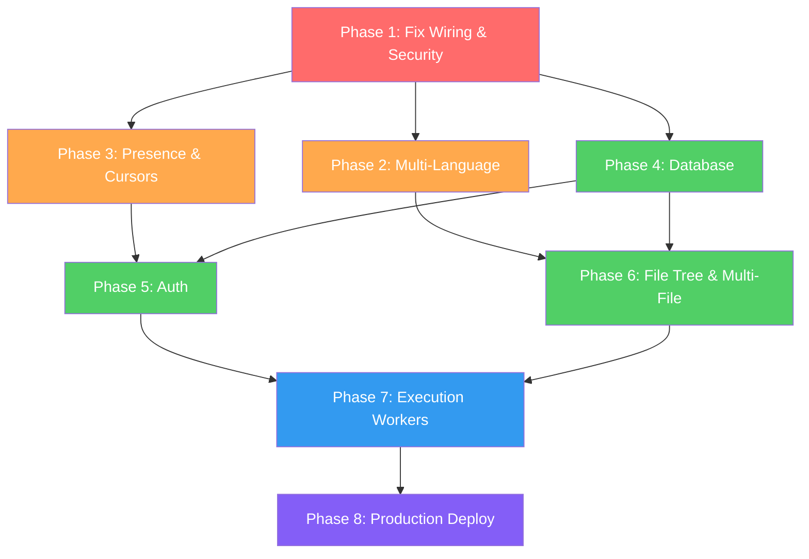

# Collaborative Code Editor — Phased Completion Plan

## Where You Are Now

```
✅ Frontend (React/Vite/Monaco)      ✅ Real-time collab (Yjs/CRDT/Rooms)
✅ Docker execution (Python)          ✅ Redis Pub/Sub (cross-server sync)
❌ Run button not wired               ❌ No database / persistence
❌ No auth                            ❌ No cursors/presence UI
❌ Python only                        ❌ No file tree
❌ No execution workers               ❌ No deployment
```

---

## Phase 1 — Fix Broken Wiring & Security Hardening
**Time: ~1 hour | Priority: CRITICAL**
**Goal**: Make the existing features actually work end-to-end.

> [!CAUTION]
> Phase 1 must be done first. You cannot demo the project right now — the Run button doesn't call the backend, and Docker has no security flags. An interviewer hitting "Run" would see raw code echoed back.

### 1.1 Wire the Run button to the execution API

#### [MODIFY] [EditorPage.tsx](file:///d:/collaborative-code-editor/Collaborative-CodeEditor/frontend/src/pages/EditorPage.tsx)
- Replace `setOutput(code)` with an actual `fetch('http://localhost:3001/execute', ...)` call
- Send `{ language, code }` in the POST body
- Display `stdout` / `stderr` from the response in the Terminal
- Add loading state ("Running...") while execution is in progress
- Handle errors gracefully

**Problem it solves**: Right now `handleRunCode()` just echoes code text. The entire Docker backend is unreachable from the UI.

#### [MODIFY] [CollaborativeEditor.tsx](file:///d:/collaborative-code-editor/Collaborative-CodeEditor/frontend/src/components/CollaborativeEditor.tsx)
- Expose a way for the parent (`EditorPage`) to read the current editor content
- Currently Yjs owns the text, but `EditorPage` has no reference to it — it can't read what the user typed
- Options: (a) use a ref callback to expose `editor.getValue()`, or (b) use a shared context/store

**Why this is tricky**: The `code` state in `EditorPage` and the Yjs-controlled content in `CollaborativeEditor` are two separate sources of truth. The `Workspace` renders `CollaborativeEditor` (Yjs-managed) but `EditorPage` passes `code` state that's never updated by Yjs. This needs reconciliation.

---

### 1.2 Docker security hardening

#### [MODIFY] [executionService.js](file:///d:/collaborative-code-editor/Collaborative-CodeEditor/sync-server/services/executionService.js)
Add security flags to the `docker run` command:
```
--cpus=0.5          → Limit to half a CPU core
--memory=128m       → Cap memory at 128MB
--pids-limit=50     → Prevent fork bombs
--network=none      → No network access from user code
--read-only         → Read-only root filesystem
--tmpfs /tmp:size=64m → Writable tmp with size limit
```

**Interview gold**: You can now explain cgroups (CPU, memory), namespaces (network isolation), and why each flag exists.

---

### 1.3 Dynamic room support in UI

#### [MODIFY] [Header.tsx](file:///d:/collaborative-code-editor/Collaborative-CodeEditor/frontend/src/components/Header.tsx)
- Accept `roomId` as a prop, display it instead of hardcoded "Room: XYZ-123"

#### [MODIFY] [Workspace.tsx](file:///d:/collaborative-code-editor/Collaborative-CodeEditor/frontend/src/components/Workspace.tsx)
- Accept `roomId` as a prop, pass it down to `CollaborativeEditor`

#### [MODIFY] [EditorPage.tsx](file:///d:/collaborative-code-editor/Collaborative-CodeEditor/frontend/src/pages/EditorPage.tsx)
- Extract `roomId` from URL params (e.g., `/room/:roomId`)
- Or generate a random room ID and put it in the URL

#### [NEW] Landing/Join Page
- Simple page: "Create Room" → generates ID, redirects to `/room/{id}`
- "Join Room" → enter room ID, redirects to `/room/{id}`
- Add `react-router-dom` for routing between landing page and editor page

---

### Phase 1 Verification
- [ ] Open two browser tabs on the same room → both see same content (already works)
- [ ] Click "Run" → see actual Python output in the terminal
- [ ] Run an infinite loop → verify 5s timeout kills it
- [ ] Verify Docker runs with security flags via `docker inspect`

---

## Phase 2 — Multi-Language Execution
**Time: ~2-3 hours | Priority: HIGH**
**Goal**: Support Python, JavaScript, C++, and Java. This is the difference between "toy" and "real code editor."

### 2.1 Language configuration system

#### [NEW] `sync-server/config/languages.js`
```javascript
module.exports = {
  python: {
    image: 'python:3.13-slim',
    filename: 'main.py',
    command: ['python', '/app/main.py'],
  },
  javascript: {
    image: 'node:20-slim',
    filename: 'main.js',
    command: ['node', '/app/main.js'],
  },
  cpp: {
    image: 'gcc:14',
    filename: 'main.cpp',
    command: ['sh', '-c', 'g++ /app/main.cpp -o /app/main && /app/main'],
  },
  java: {
    image: 'openjdk:21-slim',
    filename: 'Main.java',
    command: ['sh', '-c', 'javac /app/Main.java && java -cp /app Main'],
  },
};
```

### 2.2 Refactor execution service

#### [MODIFY] [executionService.js](file:///d:/collaborative-code-editor/Collaborative-CodeEditor/sync-server/services/executionService.js)
- Accept `language` parameter (currently ignored)
- Look up Docker image, filename, and command from the language config
- Use unique temp directories per execution (UUID-based) to prevent race conditions between concurrent users

#### [MODIFY] [execute.js](file:///d:/collaborative-code-editor/Collaborative-CodeEditor/sync-server/routes/execute.js)
- Pass `language` from `req.body` into `processCode(code, language)`
- Validate that the language is supported

### 2.3 Frontend language selector

#### [NEW] `frontend/src/components/LanguageSelector.tsx`
- Dropdown component with supported languages
- Changes Monaco editor language mode
- Sends selected language with the execution request

#### [MODIFY] [CollaborativeEditor.tsx](file:///d:/collaborative-code-editor/Collaborative-CodeEditor/frontend/src/components/CollaborativeEditor.tsx)
- Accept `language` prop
- Set Monaco's language dynamically instead of hardcoded `"javascript"`

#### [MODIFY] [Header.tsx](file:///d:/collaborative-code-editor/Collaborative-CodeEditor/frontend/src/components/Header.tsx)
- Add the language selector next to the Run button

---

### Phase 2 Verification
- [ ] Select Python → write `print("hello")` → Run → see "hello"
- [ ] Select JavaScript → write `console.log("hello")` → Run → see "hello"
- [ ] Select C++ → write a basic program → Run → see compiled output
- [ ] Select Java → write `Main.java` → Run → see output
- [ ] Run a fork bomb → verify it's killed by `--pids-limit`

---

## Phase 3 — Collaborative Presence & Cursors
**Time: ~3-4 hours | Priority: HIGH**
**Goal**: When two users are in the same room, they see each other's cursors, names, and online status. This is the "wow factor" for demos.

> [!NOTE]
> The plumbing already exists — `provider.awareness` is already passed to `MonacoBinding` in [CollaborativeEditor.tsx L47](file:///d:/collaborative-code-editor/Collaborative-CodeEditor/frontend/src/components/CollaborativeEditor.tsx#L47). You just need the UI layer.

### 3.1 Awareness state setup

#### [MODIFY] [CollaborativeEditor.tsx](file:///d:/collaborative-code-editor/Collaborative-CodeEditor/frontend/src/components/CollaborativeEditor.tsx)
- Set the local user's awareness state: `{ name, color, cursor }`
- Generate a random user name + color on mount (until auth exists)
- Listen to awareness changes to track connected users

### 3.2 Remote cursor rendering

#### [NEW] `frontend/src/styles/cursors.css`
- CSS for remote cursor decorations (colored cursor line + name label above it)
- Each remote user gets a unique color

#### [MODIFY] [CollaborativeEditor.tsx](file:///d:/collaborative-code-editor/Collaborative-CodeEditor/frontend/src/components/CollaborativeEditor.tsx)
- Use Monaco's `deltaDecorations` API or the built-in `y-monaco` cursor support to render remote cursors
- Show floating name labels at cursor positions

### 3.3 Presence panel

#### [NEW] `frontend/src/components/PresenceBar.tsx`
- Shows connected users as colored dots/avatars with names
- Positioned in the header area
- Updates in real-time as users join/leave

```
● Tanishq  ● Rahul  ● Aman
```

#### [MODIFY] [Header.tsx](file:///d:/collaborative-code-editor/Collaborative-CodeEditor/frontend/src/components/Header.tsx)
- Include the `PresenceBar` component

---

### Phase 3 Verification
- [ ] Open two browsers → both see each other's cursor with name labels
- [ ] Close one browser → presence indicator disappears within ~10 seconds
- [ ] Cursors have distinct colors per user
- [ ] Name labels follow cursor position

---

## Phase 4 — Persistent Storage (Database)
**Time: ~6-8 hours | Priority: HIGH**
**Goal**: Restarting the server doesn't destroy everything. Users, rooms, and code are persisted.

> [!IMPORTANT]
> **Database choice decision needed**: PostgreSQL (relational, strong consistency, SQL) vs. MongoDB (document-based, flexible schema). PostgreSQL is recommended for this project because your data has clear relationships (users → projects → files → rooms) and you want to talk about ACID properties in interviews.

### 4.1 Database setup

#### [NEW] `sync-server/prisma/schema.prisma` (using Prisma ORM)
```prisma
model User {
  id        String    @id @default(uuid())
  email     String    @unique
  name      String
  password  String    // bcrypt hash
  projects  Project[]
  createdAt DateTime  @default(now())
}

model Project {
  id        String   @id @default(uuid())
  name      String
  owner     User     @relation(fields: [ownerId], references: [id])
  ownerId   String
  files     File[]
  room      Room?
  createdAt DateTime @default(now())
  updatedAt DateTime @updatedAt
}

model File {
  id        String   @id @default(uuid())
  name      String
  content   String   @db.Text
  language  String   @default("javascript")
  project   Project  @relation(fields: [projectId], references: [id])
  projectId String
  createdAt DateTime @default(now())
  updatedAt DateTime @updatedAt
}

model Room {
  id        String   @id @default(uuid())
  project   Project  @relation(fields: [projectId], references: [id])
  projectId String   @unique
  isActive  Boolean  @default(true)
  createdAt DateTime @default(now())
}
```

### 4.2 Document persistence

#### [NEW] `sync-server/services/persistenceService.js`
- On a timer (e.g., every 30 seconds) or on room empty, snapshot the Y.Doc state
- Serialize via `Y.encodeStateAsUpdate(doc)` → save to database
- On room re-open, load the snapshot and apply via `Y.applyUpdate(doc, savedState)`

#### [MODIFY] [server.js](file:///d:/collaborative-code-editor/Collaborative-CodeEditor/sync-server/server.js)
- When a room becomes empty (last user disconnects), persist the document
- When a room is opened, load existing document state from DB

### 4.3 API routes for CRUD

#### [NEW] `sync-server/routes/projects.js`
- `GET /projects` — list user's projects
- `POST /projects` — create a new project
- `GET /projects/:id` — get project with files
- `DELETE /projects/:id` — delete a project

#### [NEW] `sync-server/routes/files.js`
- `GET /projects/:id/files` — list files in a project
- `POST /projects/:id/files` — create a file
- `PUT /files/:id` — update a file
- `DELETE /files/:id` — delete a file

---

### Phase 4 Verification
- [ ] Create a project via API → see it in the database
- [ ] Edit code in the editor → restart the server → code is still there
- [ ] Two users in the same room → one leaves, one stays → content persists
- [ ] `prisma studio` shows correct data in all tables

---

## Phase 5 — Authentication
**Time: ~4-5 hours | Priority: MEDIUM**
**Goal**: Login, signup, JWT tokens. Users own projects. Rooms are access-controlled.

### 5.1 Auth backend

#### [NEW] `sync-server/routes/auth.js`
- `POST /auth/register` — create user (bcrypt hash password)
- `POST /auth/login` — return JWT token
- `GET /auth/me` — return current user from token

#### [NEW] `sync-server/middleware/auth.js`
- JWT verification middleware
- Attach `req.user` to authenticated requests
- Protect project/file routes behind this middleware

### 5.2 Auth frontend

#### [NEW] `frontend/src/pages/LoginPage.tsx`
- Email + password login form
- Stores JWT in `localStorage`

#### [NEW] `frontend/src/pages/RegisterPage.tsx`
- Registration form (name, email, password)

#### [NEW] `frontend/src/context/AuthContext.tsx`
- React context to store current user + token
- `useAuth()` hook for components

#### [MODIFY] [App.tsx](file:///d:/collaborative-code-editor/Collaborative-CodeEditor/frontend/src/App.tsx)
- Add routes: `/login`, `/register`, `/room/:id`
- Redirect unauthenticated users to login

### 5.3 WebSocket authentication

#### [MODIFY] [server.js](file:///d:/collaborative-code-editor/Collaborative-CodeEditor/sync-server/server.js)
- Verify JWT on WebSocket connection (passed as query param)
- Reject unauthorized connections
- Use the authenticated user's name/color for awareness

---

### Phase 5 Verification
- [ ] Register → Login → get redirected to dashboard
- [ ] Unauthenticated user cannot open a room
- [ ] JWT expires → user is redirected to login
- [ ] User's name appears on collaborative cursors instead of random name

---

## Phase 6 — File Tree & Multi-File Projects
**Time: ~5-6 hours | Priority: MEDIUM**
**Goal**: Real project structure with multiple files, not just a single editor pane.

### 6.1 File tree component

#### [MODIFY] [Sidebar.tsx](file:///d:/collaborative-code-editor/Collaborative-CodeEditor/frontend/src/components/Sidebar.tsx)
- Replace static `<li>` list with a dynamic tree component
- Fetch files from `GET /projects/:id/files`
- Support creating, renaming, deleting files
- Highlight the currently active file
- Icons by file extension

### 6.2 Multi-file editing

#### [MODIFY] [CollaborativeEditor.tsx](file:///d:/collaborative-code-editor/Collaborative-CodeEditor/frontend/src/components/CollaborativeEditor.tsx)
- Each file in the project gets its own `Y.Text` shared type (keyed by file ID)
- Switching files = switching which `Y.Text` is bound to Monaco
- Example: `ydoc.getText('file-abc123')` vs `ydoc.getText('file-def456')`

### 6.3 Tab bar

#### [NEW] `frontend/src/components/TabBar.tsx`
- Show open files as tabs (like VS Code)
- Click to switch, "×" to close
- Unsaved indicator (dot on tab)

### 6.4 Multi-file execution

#### [MODIFY] [executionService.js](file:///d:/collaborative-code-editor/Collaborative-CodeEditor/sync-server/services/executionService.js)
- Accept an array of files (not just one)
- Write all files to the temp directory
- Execute the designated "main" file

---

### Phase 6 Verification
- [ ] Create a project with 3 files → see them in sidebar
- [ ] Click a file → editor switches to that file's content
- [ ] Two users can edit different files in the same project simultaneously
- [ ] Run multi-file C++ project (main.cpp + utils.h) → successful compilation

---

## Phase 7 — Execution Workers & Job Queue
**Time: ~4-5 hours | Priority: MEDIUM**
**Goal**: Separate code execution from the collaboration server. This is the architecture move that makes the system production-ready.

```
Current:
  WebSocket Server → spawns Docker directly (blocks the event loop)

Target:
  WebSocket/API Server → enqueues job → Bull queue → Redis → Worker picks up → Docker
```

### 7.1 Job queue setup

#### Install `bull` or `bullmq` + configure Redis as the queue backend

#### [NEW] `sync-server/services/executionQueue.js`
- Create a Bull queue named `code-execution`
- The API route enqueues a job instead of running Docker directly
- Return a job ID to the frontend

#### [NEW] `sync-server/workers/executionWorker.js`
- A separate Node process that consumes jobs from the queue
- Runs Docker containers
- Reports results back via the queue

### 7.2 Async execution with polling or WebSocket updates

#### [MODIFY] [execute.js](file:///d:/collaborative-code-editor/Collaborative-CodeEditor/sync-server/routes/execute.js)
- `POST /execute` → returns `{ jobId }` immediately
- `GET /execute/:jobId` → poll for result, OR
- Push result via WebSocket to the client

#### [MODIFY] Frontend execution flow
- Show "Running..." with a spinner
- Poll for result or listen for WebSocket event
- Display stdout/stderr when ready

### 7.3 Worker scaling

#### [NEW] `docker-compose.yml`
```yaml
services:
  server:
    build: ./sync-server
    ports: ["3001:3001"]
    depends_on: [redis]
  
  worker:
    build: ./sync-server
    command: node workers/executionWorker.js
    depends_on: [redis]
    deploy:
      replicas: 3    # ← Scale workers independently
  
  redis:
    image: redis:7-alpine
    ports: ["6379:6379"]
```

---

### Phase 7 Verification
- [ ] Submit code → get job ID → poll → get result
- [ ] Run 5 concurrent executions → all complete (workers don't block each other)
- [ ] Kill a worker → remaining workers continue processing
- [ ] `docker-compose up --scale worker=3` → see 3 worker containers

---

## Phase 8 — Production Infrastructure & Deployment
**Time: ~6-8 hours | Priority: LOW (for functionality, HIGH for resume)**
**Goal**: Actually deploy this. Not "I could deploy it" but "it's running."

### 8.1 Nginx reverse proxy

#### [NEW] `nginx/nginx.conf`
```nginx
upstream collab_servers {
    server server1:3001;
    server server2:3002;
}

server {
    listen 80;
    
    location / {
        proxy_pass http://collab_servers;
        proxy_http_version 1.1;
        proxy_set_header Upgrade $http_upgrade;      # WebSocket support
        proxy_set_header Connection "upgrade";
        proxy_set_header Host $host;
    }
}
```

Key configs:
- WebSocket upgrade headers (critical — without these, Yjs won't connect)
- Sticky sessions (ip_hash) for WebSocket affinity
- SSL/TLS termination with Let's Encrypt
- Rate limiting

### 8.2 Docker Compose for the full stack

#### [NEW] `docker-compose.prod.yml`
```
Nginx (port 80/443)
  ↓
Server 1 (port 3001)  ←→  Redis  ←→  Server 2 (port 3002)
  ↓                                      ↓
Worker 1                               Worker 2
  ↓                                      ↓
Docker-in-Docker (DinD)              Docker-in-Docker (DinD)
  ↓
PostgreSQL
```

### 8.3 AWS Deployment

- **EC2** or **ECS/Fargate** for containers
- **ElastiCache** for managed Redis
- **RDS** for managed PostgreSQL
- **ALB** for load balancing with WebSocket support
- **Route 53** for DNS
- **ACM** for SSL certificate

### 8.4 Monitoring & Logging

#### [NEW] `sync-server/middleware/logger.js`
- Request logging (method, path, status, duration)
- WebSocket connection/disconnection logging

#### Health check endpoint
- `GET /health` → returns server status, Redis connectivity, DB connectivity
- Used by load balancer to route traffic away from unhealthy instances

#### Metrics to track
| Metric | Why |
|---|---|
| Active WebSocket connections | Capacity planning |
| Redis pub/sub latency | Cross-server sync health |
| Execution queue depth | Worker saturation |
| Execution duration (p50, p95, p99) | Performance baseline |
| Container start time | Cold start optimization |
| Failed executions | Reliability |
| Memory usage per server | Leak detection |

---

### Phase 8 Verification
- [ ] `curl https://your-domain.com/health` → 200 OK
- [ ] Two users on different servers (via load balancer) can collaborate
- [ ] SSL certificate valid (no browser warnings)
- [ ] Server restart → users reconnect automatically → content persists

---

## Phase Dependency Map



---

## Timeline Estimate

| Phase | Effort | Cumulative | Resume Impact |
|---|---|---|---|
| **Phase 1** — Fix Wiring & Security | ~1 hour | 1 hr | 🔴 **Critical** — project is broken without this |
| **Phase 2** — Multi-Language | ~2-3 hours | 4 hrs | 🟠 High — "only runs Python" is a weak demo |
| **Phase 3** — Presence & Cursors | ~3-4 hours | 8 hrs | 🟠 High — the "wow factor" for collaborative editing |
| **Phase 4** — Database | ~6-8 hours | 16 hrs | 🟢 Medium — persistence is expected in a real app |
| **Phase 5** — Auth | ~4-5 hours | 21 hrs | 🟢 Medium — needed for multi-user, but not flashy |
| **Phase 6** — File Tree | ~5-6 hours | 27 hrs | 🟢 Medium — transforms from "editor" to "IDE" |
| **Phase 7** — Workers | ~4-5 hours | 32 hrs | 🔵 Architecture — major interview talking point |
| **Phase 8** — Deployment | ~6-8 hours | 40 hrs | 🟣 Polish — "it's actually running" vs. "I could deploy it" |

> [!TIP]
> **Minimum viable demo** = Phases 1-3 (~8 hours). After those, you have a working collaborative editor with multi-language execution and visible cursors. That's demo-ready and interview-ready.

> [!IMPORTANT]
> **For a strong resume claim** = Phases 1-6 (~27 hours). This gives you a real product: auth, persistence, multi-file projects, multi-language execution, and real-time collaboration. Everything an interviewer would expect.

## Open Questions

> [!IMPORTANT]
> **Database choice**: PostgreSQL (with Prisma) vs. MongoDB (with Mongoose)? I've assumed PostgreSQL because your data model has clear relationships and you'd want to discuss ACID in interviews. Let me know if you prefer MongoDB.

> [!IMPORTANT]
> **Do you want to start from Phase 1 and go sequentially, or jump to a specific phase?** Phases 1-3 have no database dependency and can be done immediately. Phase 4+ requires setting up PostgreSQL.

> [!NOTE]
> **Deployment target**: The plan assumes AWS (EC2/ECS), but could work on any cloud or even a VPS like DigitalOcean. Do you have a preference?
